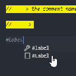

# Label In Line

Install from marketplace.



[Label in line](https://marketplace.visualstudio.com/items?itemName=TusharSahaTonoy.label-in-line)

## Usage

Press '#' in you code and press ctrl + space bar for suggestion and chose **'Label'** else type **'// ---->'** and you comment will be light up.

## Main Objective
The main objective of this extension is to make a simple way to **highlight** a string or some text in your code so that it will be so much easier to **navigate** a part of code and we don't have to use **find or search** option again and again.

### Simple Way To Highlight


### Easier To Navigate


## Supported language. 
- PHP 
- Java
- CPP
- C
- Python
- Laravel Blade

For color customization, in the user settings, add
```
"workbench.colorCustomizations": {
	"labelInLine.labelBackground": "#ff00ff"
}
```

### Disable the extension
Go to command palette (Press Ctrl+ Shift + P). Run the command `Label In Line : Toggle`.
